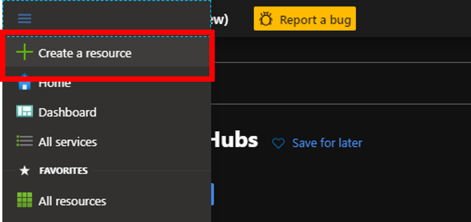
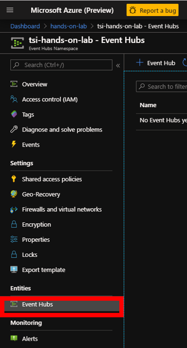
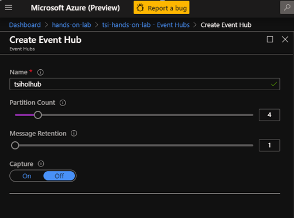
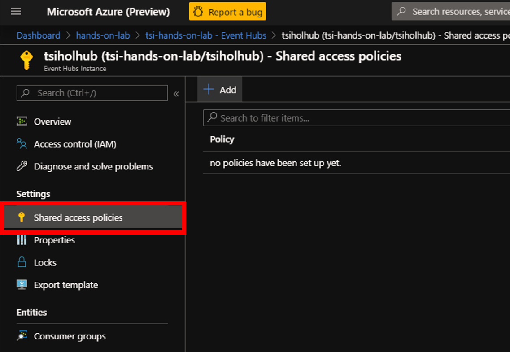
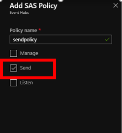
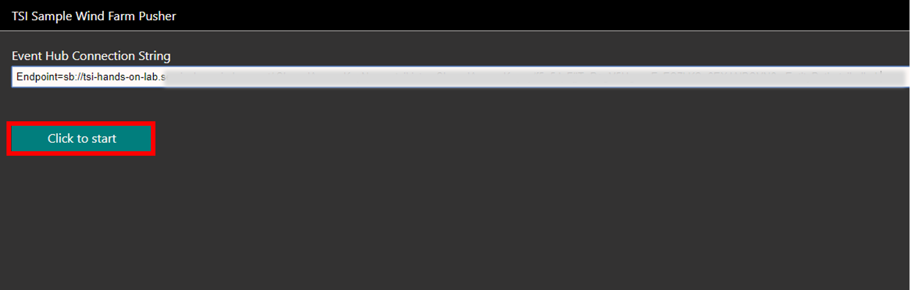
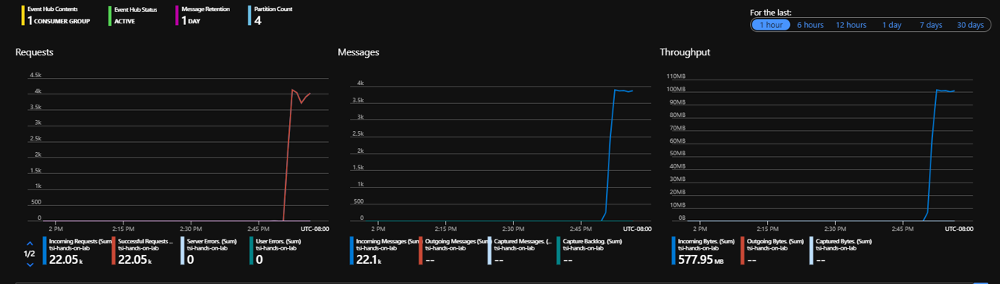

## Step 2: Event Hub Set-Up and Device Simulation

Azure IoT Time Series Insights preview supports both IoT Hub and Event Hubs as event sources. In this lab we'll be setting up an Event Hub and leverage a SPA client to generate and push wind mill sensor data to the hub.

### Create a resource group

1. Create a new Azure resource group (RG) to collect and manage all the application resources we will be provisioning and using during the lab and for ease of resource clean-up post lab. If you prefer, you can also re-use an existing RG.
\

1. Click on **+ Add** button  
\

1. Enter **Resource group name**,  Select **subscription** and **region**. Click on **Review + Create**, and after reviewing, click on **Create**.

### Create an Event Hubs namespace and an Event Hub

TSI preview supports both Azure IoT Hub and Events Hubs as event sources. Up to two event sources are permitted per TSI environment. In this lab we will use an Event Hub as our event source.

1. On the upper left hand corner of the Azure portal click the tool bar and select Create a resource

1. Search the marketplace for "Event Hubs" and click create

1. When you set-up Event Hubs first you create the hub namespace, then you instantiate a hub. Fill out the form with the following parameters:

**Parameter**|**Action**
-----|-----
Name|Enter a unique name for the Event Hubs Namespace.
Pricing tier|Select Standard (20 Consumer groups, 1000 Brokered connections).
Subscription|Select the subscription you're using for the lab.
Resource group|Select the RG you created or re-used from the previous step.
Location|Select your RG location. Note that as a best practice it's recommended to house your event source and TSI environment in the same location. 
Throughput Units|Enter a globally unique name for a new storage account.
Enable Auto-Inflate|Check the checkbox to enable.
Auto-Inflate Maximum Throughput Units|Slide to 12 units.

1. Once your deployment is complete, navigate to your Event Hubs Namespace and click on Event Hubs:

1. Create an Event Hub with a Parition Count of 4.

1. Now that your cloud gateway has been created you need to configure access policies and generate a connection string to enable both sending and reading hub telemetry messages. Creating both a Send and Listen policy follows the principle of least privilege. Navigate to your Event Hub and click on Shared access policies:

1. Create both a Send policy as well as a Listen policy

1. Click on the newly created Send policy and 

1. Copy [this link](https://tsiclientsample.azurewebsites.net/windFarmGen.html) to the TSI Sample Wind Farm Pusher client app and open the link in a separate browser window. Toggle back to the Azure portal, and click on your newly created Send policy. Copy the "Connection string–primary key" to your clipboard. Paste the connection string into the input field in the TSI Sample Wind Farm Pusher. NOTE: When using the Chromium browser with many tabs open there is a slight risk that the ajax calls will be throttled by the browser itself if it has insufficient recources. If you experience a failure message try using a different browser such as Edge to push data.

The simulator will continue to push data until the browser tab is closed.

After clicking start a JSON file is downloaded. If you need to grant the browser permission to download this file do that now and then re-click start. This file has the simulated time series' data model and we will use it in a future step to bulk-provision our time series instances.

1. Navigate back to your Event Hub, the metrics on the overview tab should now show data flowing into the hub:

Continue on to the [next step](../step-003-tsi-env-creation)

