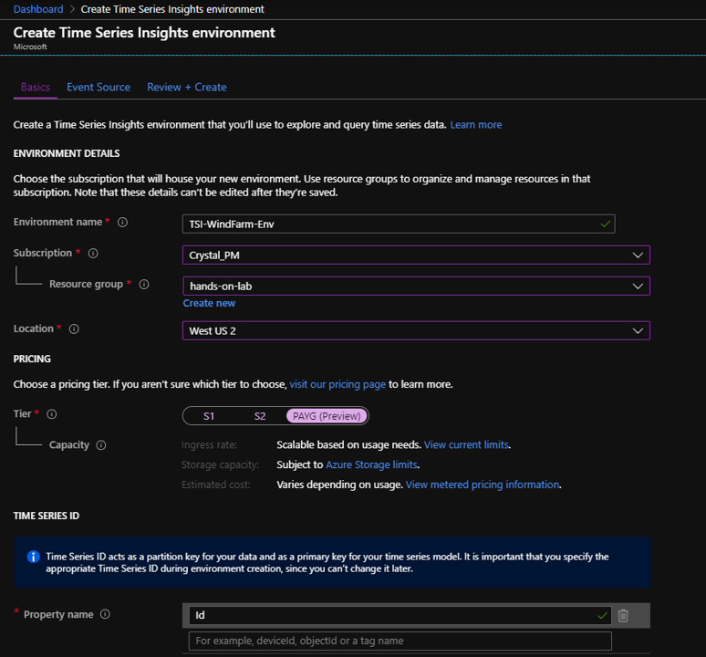
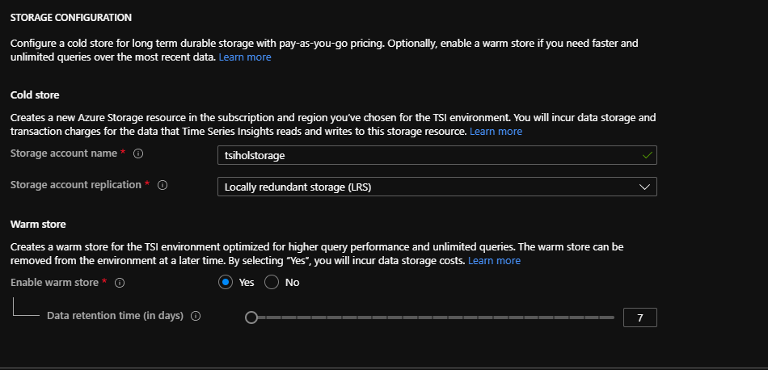
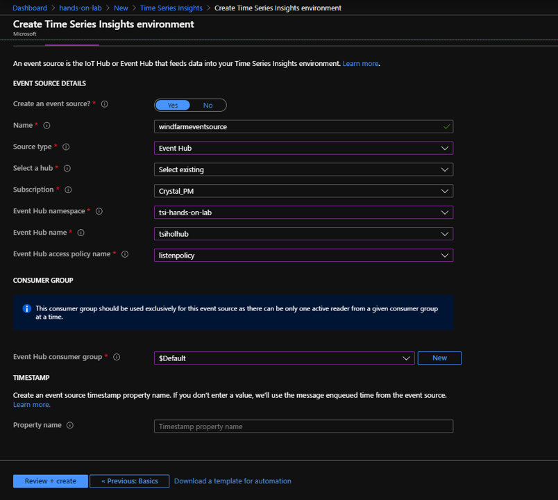
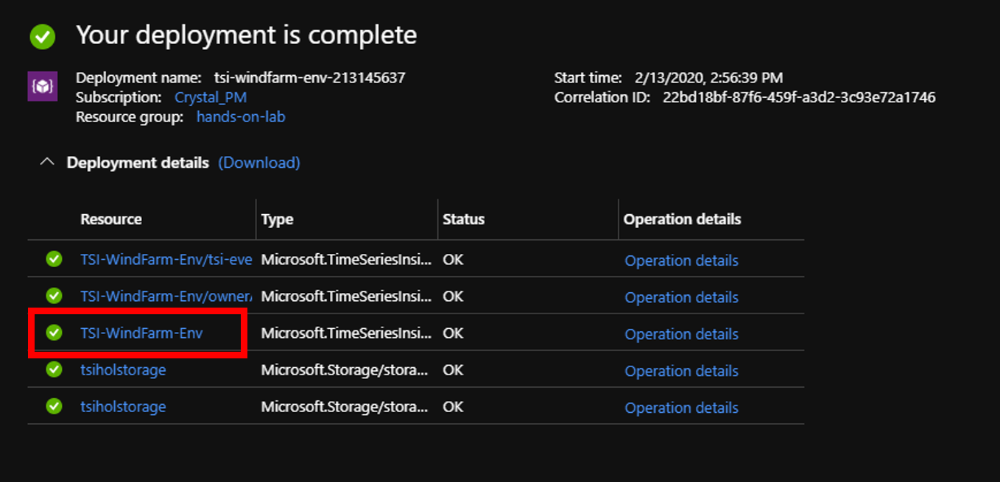
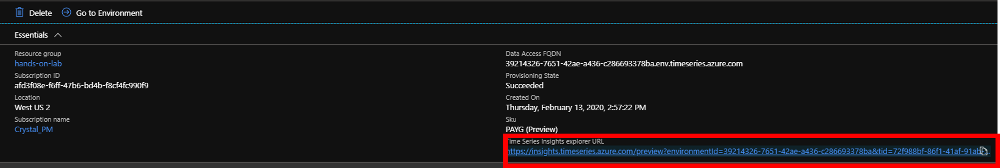
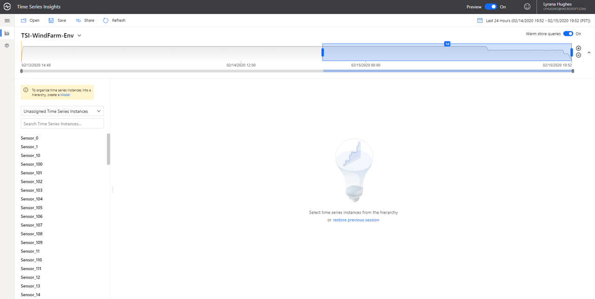

## Step 3: Create an Azure Time Series Insights Preview environment

1. Click the toolbar in the upper left corner of the poratl and search the Azure marketplace for "Time Series Insights". Click create and configure your TSI environment similar to the sample image below. See the table below the images for more details on each input field.

**Parameter**|**Action**
-----|-----
Environment name|Enter a unique name for the Azure Time Series Insights Preview environment.
Subscription|Select the subscription you're using for the lab.
Resource group|Select your RG.
Location|Select a datacenter region for your Azure Time Series Insights Preview environment. To avoid additional latency, it's best to create your Azure Time Series Insights Preview environment in the same region as your IoT or Event Hub created in the previous step.
Tier|Select PAYG (pay-as-you-go). This is the SKU for the Azure Time Series Insights Preview product.
Time Series ID Property name| Enter "Id" as this is the TS ID used by the data simulator. Note that the value you select for your TS ID is immutable. You can't change it later.
Storage account name|Enter a globally unique name for a new storage account.
Enable Warm Store?|Select Yes to enable warm store.
Data Retention (days)|Choose the default option of 7 days

1. Click on “Next: Event Source” to establish a connection between your Event Hub and TSI:

**Parameter**|**Action**
-----|-----
Create an event source?|Select Yes.
Name|Enter a unique value for the event source name.
Source type|Select Event Hub.
Select a hub|Choose Select existing.
Subscription|Select the subscription that you're using for the lab.
Event Hub namespace|Select the namespace created in Step 2.
Event Hub name|Select the hub created in Step 2.
Event Hub access policy name|Select the name of the Listen policy created in Step 2. 
Event Hub consumer group|Select $Default. Note that if you intend to Listen via another app or service you should have unique constumer groups for each listener.
Timestamp property|This value is used to identify the Timestamp property in your incoming telemetry data. Leave this box empty. When left empty, Time Series Insights will default to the message enqueued timestamp set by IoT Hub or Event Hub. This is sufficient for the lab.

1. Click on “Review + create,” review the values entered and click “Create”

1. It will take up to a coupld minutes for your deployment to complete. When ready, navigate to your new Time Series Insights resource, it's typically the third resource down in the list of succssful deployments:

1. You should have access to your environment by default. To verify, select "Data Access Policies" under "Settings." If you do not see your credentials listed, grant yourself access by clicking "Add" and searching for your identity.

1. In the overview pane you will see the link to your TSI explorer, the user-interface that ships with your PaaS. Click on your explorer URL. 

1. Coming to your TSI explorer, your default view should look similar to the image below:

1. Continue to the [next step](../step-004-explorer-intro) for an overview of the explorer

