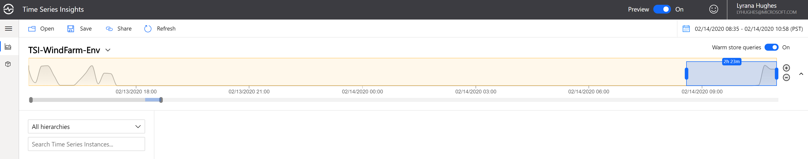
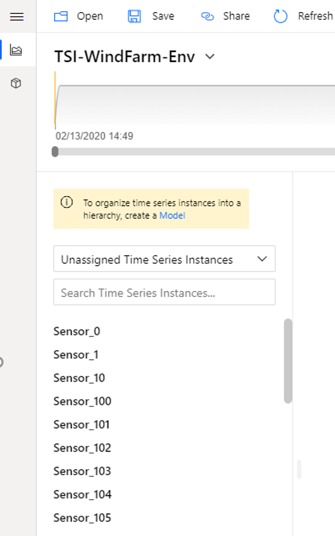

## Step 4: Azure Time Series Insights Explorer Overview

### Explorere Overview
Welcome to the explorer! Some of the key features include:

1. Selecting a time range: You can select a different time range by dragging the handles of the availability picker, or using the date-time selector in the top right corner. You can expand the bar to see the volume of data over time, or keep it collapsed for a slimmer look. Any time selection that is within the orange bar boundary will query your Time Series Insights environment’s warm store. Warm storage is configurable for up to 31 days retention, and is designed for frequent querying of recent data. There is no charge for these queries.

2. Hierarchy: On the left, you’ll see the Time Series Model (TSM) hierarchy. Time series that are not yet configured to a hierarchy will fall under the default of “Unassigned Time Series Instances.”

3. Plotting: In the middle of the page is the charting pane where you can visualize events and perform analysis. Below the charting pane is the well which offers additional settings such as time shift and step interpolations.

4. Continue to the [next step](../step-005-tsm-creation) to create a data model.
