## Step 6: Chart and Query Data

So now that we’ve created a model for our data, we can start querying it via the TSI Explorer.

Time Series Insights offers 3 query APIs: GetEvents, GetSeries and AggregateSeries. 
1. GetEvents lets you query for raw events for one TSID over a selected search span. 
1. GetSeries allows you to perform calculations on the raw events and retrieve the results for one TSID over a selected search span. 
1. AggregateSeries allows you to retrieve one aggregated result per interval for one TSID over a selected search span. 

To query your data, expand your model, select an instance and click on the instance itself to see which variables are available. Use the “Wind Farm – Physical” hierarchy to select the Outdoor Temperature tag from WM1 in Bristol and show the Value. 

       [!TIP]
       Make sure you’ve selected a region in the availability chart where there is data available for query. 

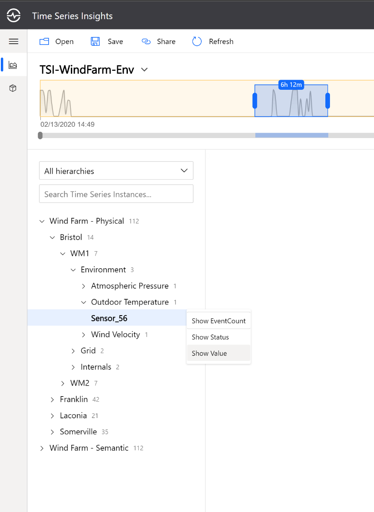

You should see your time series displayed in the chart. When you display a time series, Time Series Insights makes an AggregateSeries call. Change the search span and intervals to see different results from the query. 

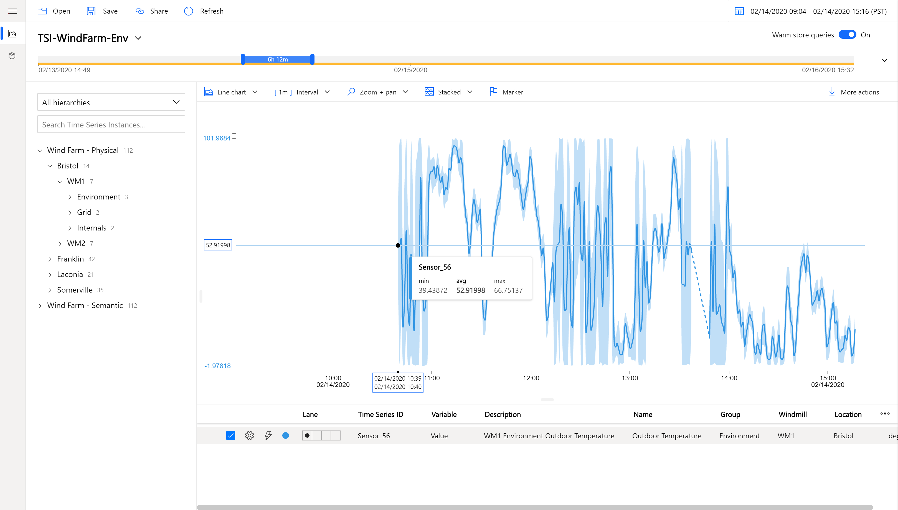

Brush over a region and click Explore Events to make a GetEvents call and see the raw data for the selected region:

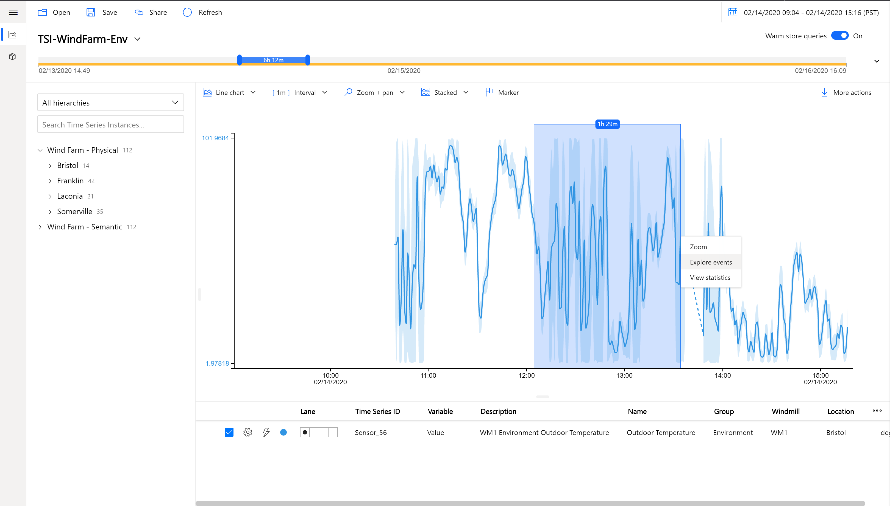

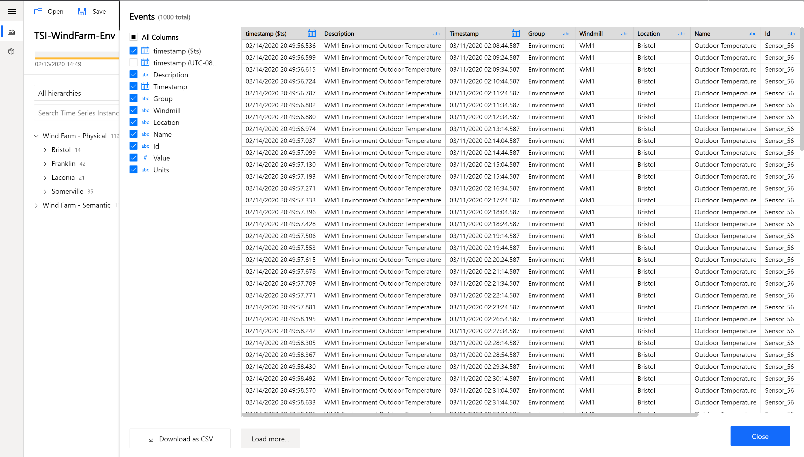

Create a time-shifted version of the trendline you just plotted by selecting the “Explorations” icon (shaped like a lighting bolt) to find any recurring patterns in the data: 

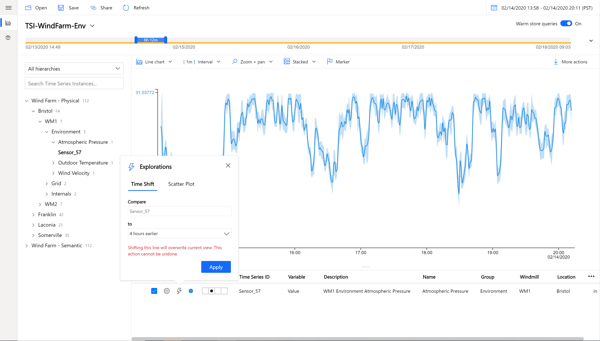

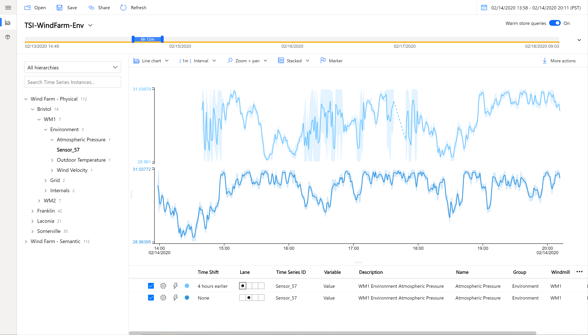

Change the chart type to view the temperature data as a heatmap:

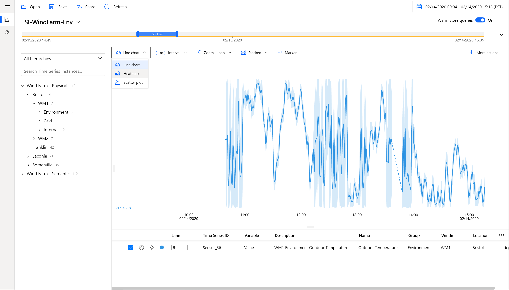

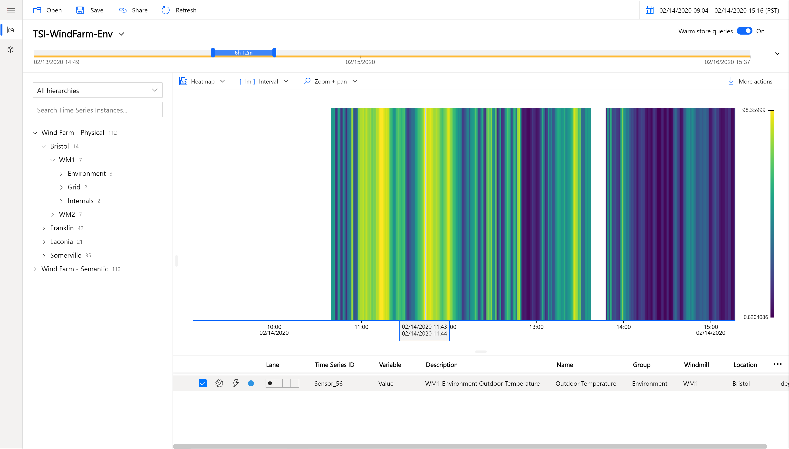

Next, add another time series, Outdoor Pressure from WM1 in Bristol. 

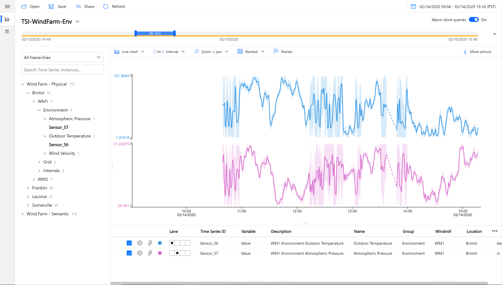

Use the scatter plot option to view the correlation between the Outdoor Temperature and the Atmospheric Pressure: 

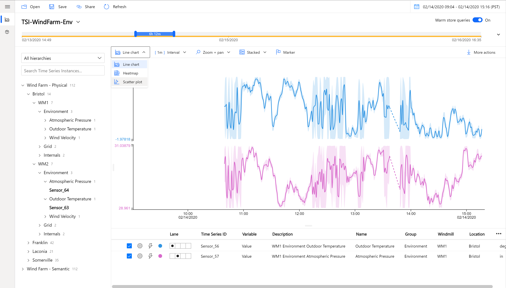

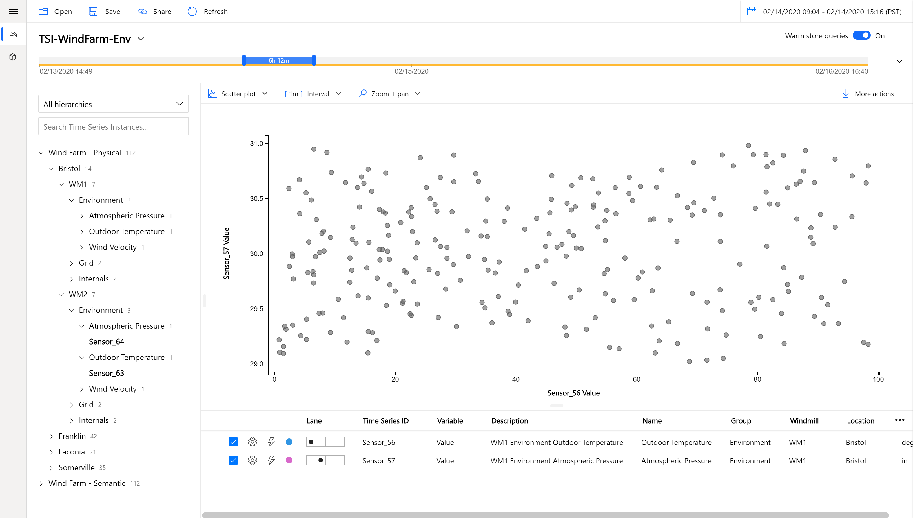

Brush over a region to show some common statistics for a region:

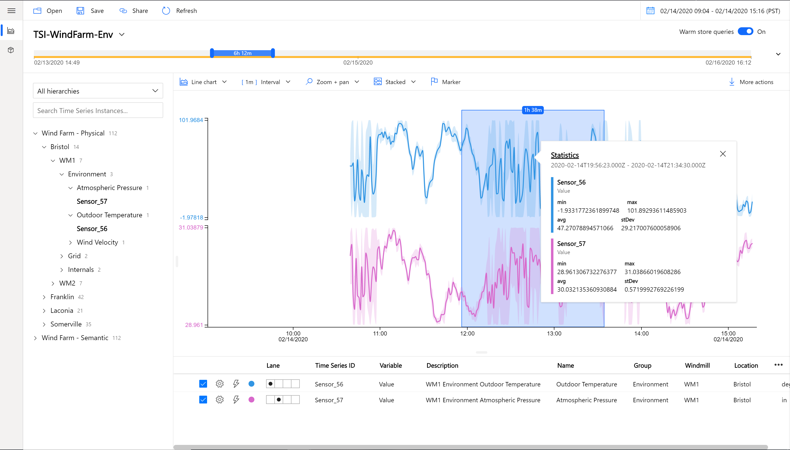

Add the values of Outdoor Temperature and Atmospheric Pressure from WM2 in Bristol. Use the Lane changers to move the time series from WM1 and WM2 into the same lanes:

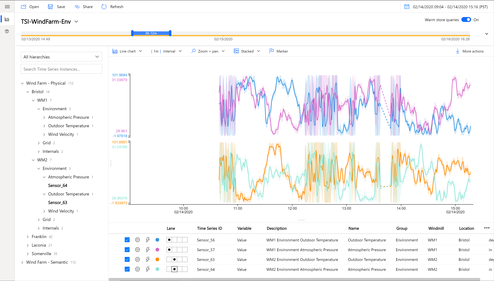

To export data, use the the “More actions” button. Some options include downloading the data as a CSV and generating a query to connect to PowerBI. 

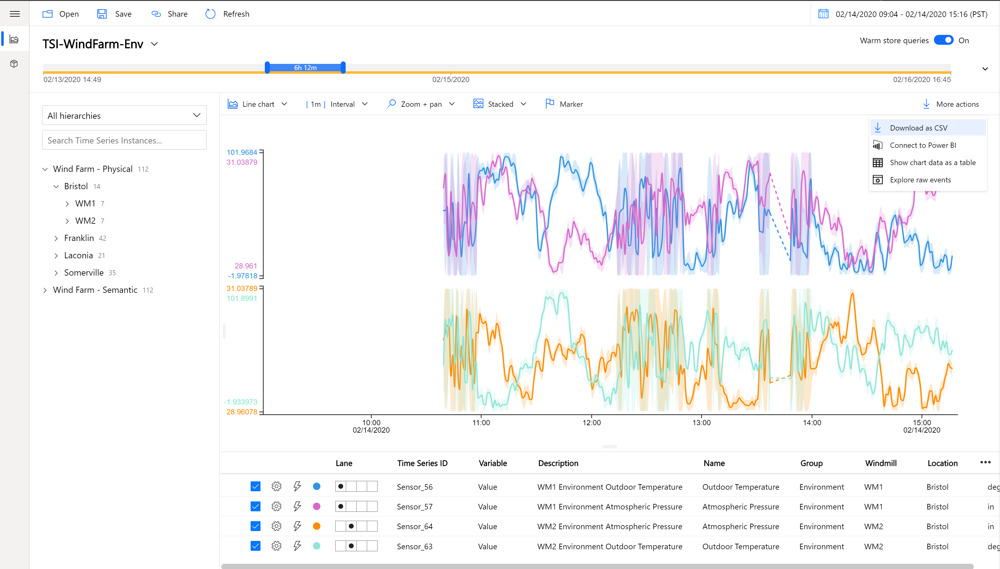

To try out the Power BI Connector, you must have the desktop version of Power BI installed. If you do, see [here](https://docs.microsoft.com/en-us/azure/time-series-insights/how-to-connect-power-bi) for steps on how to use it.

Some solutions require highly customized applications. We offer a JavaScript SDK for developers building their own front-end applications. Learn more [here](https://github.com/Microsoft/tsiclient).

Continue to section   [next step](../step-007-resource-links)